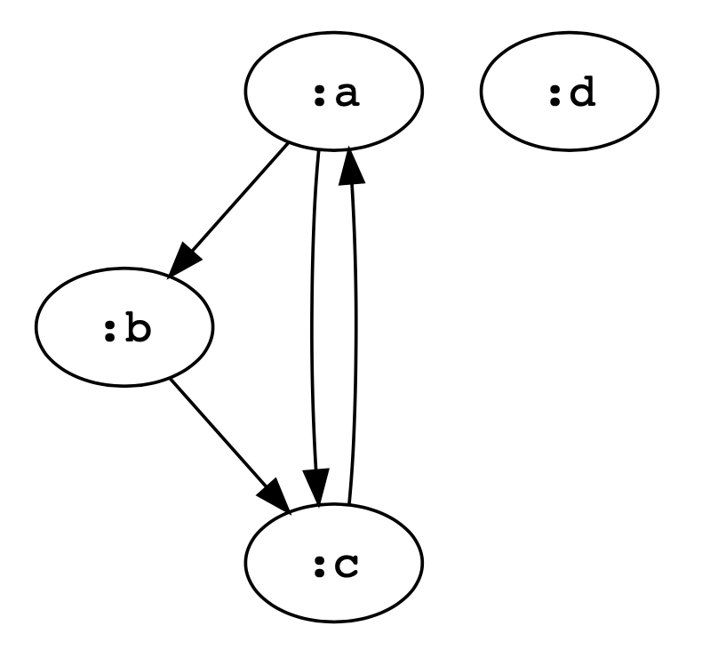
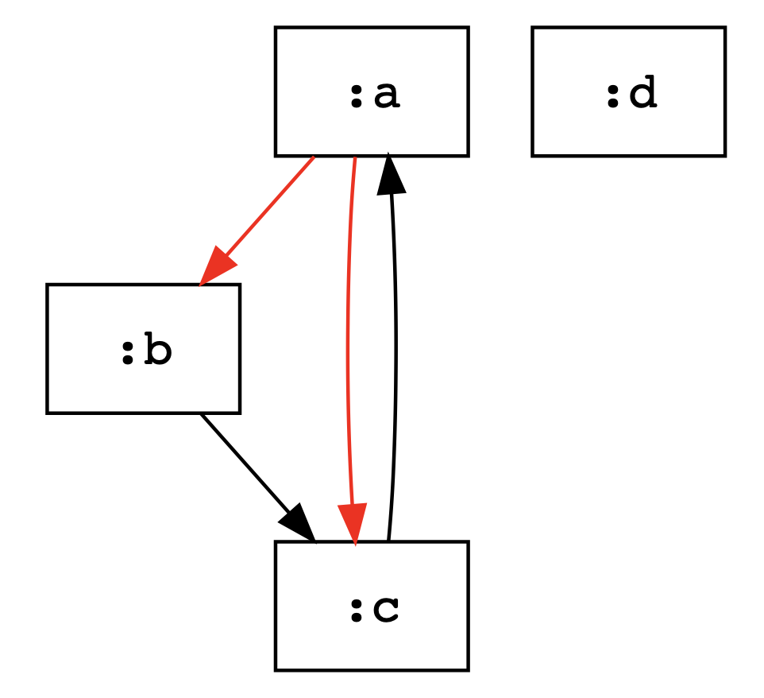
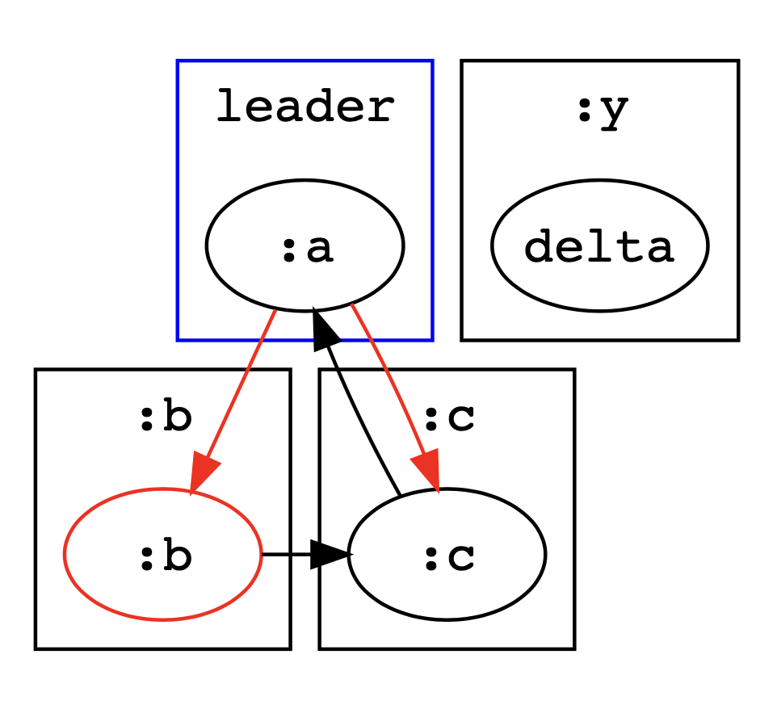
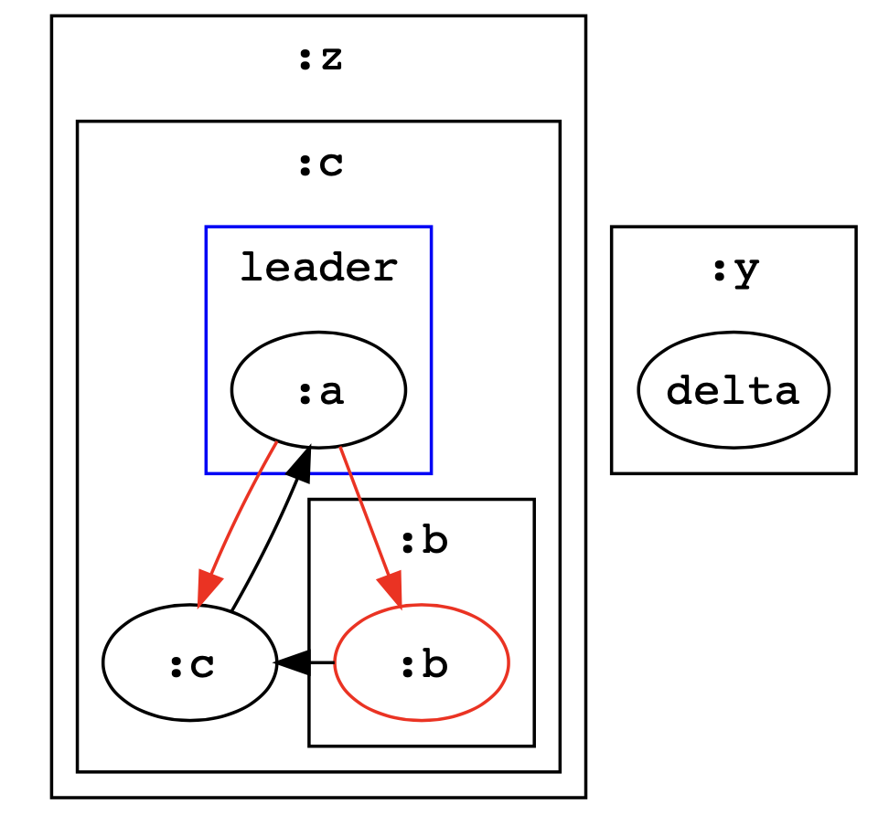
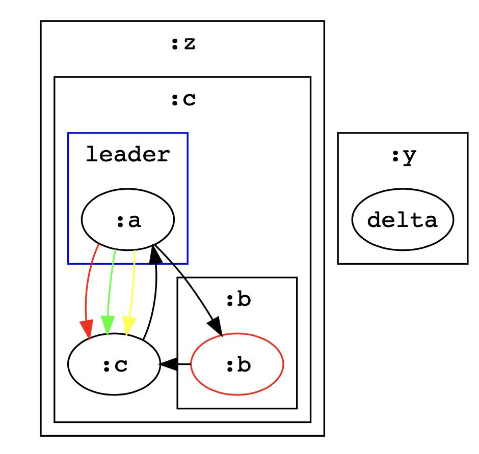
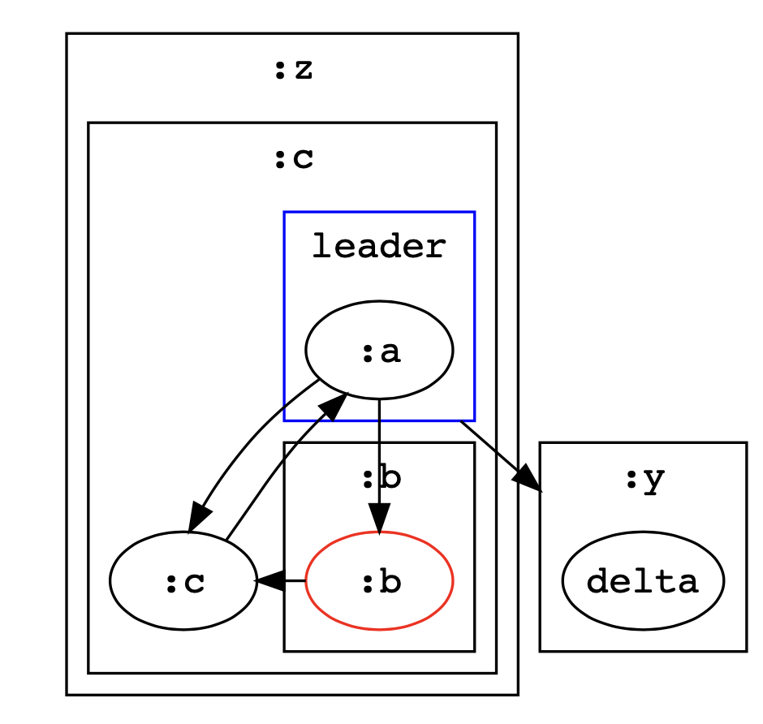
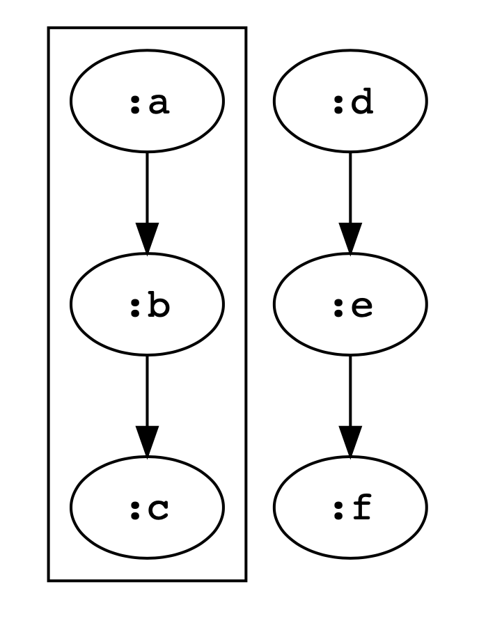
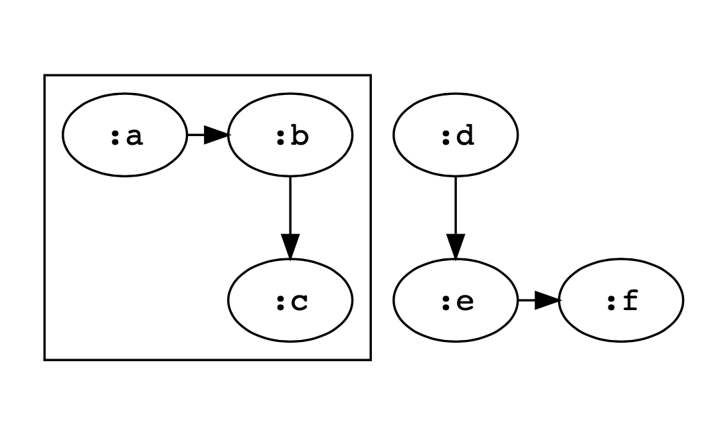

Mycelium is a library for converting a Clojure representation of a graph data structure to Graphviz's 'dot' input language.

Mycelium borrows heavily from Zach Tellman's wonderful Rhizome library. Rhizome has a few limitations though which I wanted to tackle in this library. Mycelium:

  - Works in both Clojurescript as well as Clojure.
  - Handles graphs that have multiple edges between (the same) nodes sensibly. Although Rhizome can be made to support multiple edges, it wasn't documented or terribly natural.
  - Allows for graphs to have complex cluster hierarchies.
  - The main `graph->dot` function is more simply written (less recursion).
  - The dot output is properly indented and therefore more readable.


## Usage

To include in your project:

```clj
;; deps.edn

{net.clojars.jude/mycelium {:mvn/version "0.1.0"}}
```

The project only has one namespace `mycelium.core` and one public function `graph->dot` which takes a collection of nodes and a collection of edges. Both can be of any type.

These can be followed by zero or more of the following keyword arguments.


| name | description |
|------|-------------|
| `:directed?` | whether the graph should be rendered as a directed graph, defaults to true |
| `:options` | a map of Graphviz attributes which apply to the whole graph. You can optionally specify under the `:node` and `:edge` keys sub-maps of Graphviz attributes to be applied to all nodes and edges that are overridden on a per node or edge basis by... |
| `:node->descriptor` | takes a node, and returns a map of Graphviz attributes onto values describing how the node should be rendered |
| `:edge->descriptor` | takes an edge, and returns a map of Graphviz attributes onto values describing how the edge should be rendered. |
| `:edge->src` and `:edge->dest` | functions that return the source and destination node for the edge, defaulted to `first` and `second`. |
| `:node->cluster` | takes a node and returns the cluster that the node is in |
| `:cluster->parent` | takes a cluster and returns which cluster, if any, it is contained within |
| `:cluster->descriptor` | takes a cluster and returns a map of Graphviz attributes onto values describing how the cluster should be rendered |
| `:cluster->ranks` | takes a cluster and returns a seq of seqs of nodes, the nodes in each seq of nodes will be assigned rank=same |

The rendering attributes described by `:node->descriptor`, `:edge->descriptor`, `:cluster->descriptor`, and `:options` are described in detail [here](http://www.graphviz.org/content/attrs).  String and keyword values are interchangeable.

You'll have to feed the dot string output of this library into Graphviz yourself.


## Examples

(visualizations provided by the online Graphviz viewer [viz-js](http://viz-js.com))


```clj
> (use 'mycelium.core)
nil
> (println (graph->dot [:a :b :c :d]   ; the set of nodes in the graph
                       [[:a :b] [:a :c] [:b :c] [:c :a]]    ; and the edges
                       :node->descriptor (fn [n] {:label n})))

;; the 'dot' output

digraph {
    graph[dpi=62, fontname="Monospace"]
    node[fontname="Monospace"]
    edge[fontname="Monospace"]

    node10589[label=":a"]
    node10587[label=":b"]
    node10585[label=":c"]
    node10591[label=":d"]

    node10589 -> node10587[label=""]
    node10589 -> node10585[label=""]
    node10587 -> node10585[label=""]
    node10585 -> node10589[label=""]
}
```

visualized:



Adding in an `edge->descriptor` with conditional logic:

```clj
> (println (graph->dot [:a :b :c :d]
                       [[:a :b] [:a :c] [:b :c] [:c :a]]
                       :node->descriptor (fn [n] {:label n :shape "box"})
                       :edge->descriptor (fn [e] (if (= :a (first e)) {:color "red"}))))
```



Adding in clusters and more logic into the descriptors:

```clj
> (println (graph->dot [:a :b :c :d]
                       [[:a :b] [:a :c] [:b :c] [:c :a]]
                       :node->descriptor (fn [n] {:color (when (= n :b) "red")
                                                  :label (if (= n :d) "delta" n)})
                       :cluster->descriptor (fn [c] (if (= c :a)
                                                   {:label "leader" :color "blue"}
                                                   {:label c}))
                       :node->cluster {:a :a :b :b :c :c :d :y}
                       :edge->descriptor (fn [e] (if (= :a (first e)) {:color "red"}))))
```



Adding `cluster->parent` to express clusters hierarchies:


```clj
> (println (graph->dot [:a :b :c :d]
                       [[:a :b] [:a :c] [:b :c] [:c :a]]
                       :node->descriptor (fn [n] {:color (when (= n :b) "red")
                                                  :label (if (= n :d) "delta" n)})
                       :cluster->descriptor (fn [c] (if (= c :a)
                                                 {:label "leader" :color "blue"}
                                                 {:label c}))
                       :node->cluster {:a :a :b :b :c :c :d :y}
                       :cluster->parent {:a :c :b :c :c :z}                                         
                       :edge->descriptor (fn [e] (if (= :a (first e)) {:color "red"}))))
```




Using a map to describe the edges so that an `id` key can be added to differentiate between multiple edges. The `id` key can then be picked up by the supplied `edge->descriptor` function:

```clj
> (println (graph->dot [:a :b :c :d]
                       [{:src :a :dest :b}
                        {:src :a :dest :c :id 1}
                        {:src :a :dest :c :id 2}
                        {:src :a :dest :c :id 3}
                        {:src :b :dest :c}
                        {:src :c :dest :a}]
                       :node->descriptor (fn [n] {:color (when (= n :b) "red")
                                                  :label (if (= n :d) "delta" n)})
                       :cluster->descriptor (fn [c] (if (= c :a)
                                                 {:label "leader" :color "blue"}
                                                 {:label c}))
                       :node->cluster {:a :a :b :b :c :c :d :y}
                       :cluster->parent {:a :c :b :c :c :z}
                       :edge->src :src
                       :edge->dest :dest
                       :edge->descriptor (fn [e] (case (:id e)
                                                   1 {:color "red"}
                                                   2 {:color "green"}
                                                   3 {:color "yellow"}
                                                   {:color "black"}))))

```




Some graphviz attributes in nodes or edges have values refer to other nodes or clusters.
For example, when `compound=true` is set for the graph, the `ltail` and `lhead` attributes can be used to produce edges between clusters rather than nodes. Use the special form `[:cluster <the-cluster>]` or `[:node <the-node>]` to produce these effects:

```clj
> (println (graph->dot [:a :b :c :d]
                       [{:src :a :dest :b}
                        {:src :a :dest :c}
                        {:src :b :dest :c}
                        {:src :c :dest :a}
                        {:src :a :dest :d :ltail [:cluster :a] :lhead [:cluster :y]}]
                       :node->descriptor (fn [n] {:color (when (= n :b) "red")
                                                  :label (if (= n :d) "delta" n)})
                       :cluster->descriptor (fn [c] (if (= c :a)
                                                 {:label "leader" :color "blue"}
                                                 {:label c}))
                       :node->cluster {:a :a :b :b :c :c :d :y}
                       :cluster->parent {:a :c :b :c :c :z}
                       :edge->src :src
                       :edge->dest :dest
                       :edge->descriptor (fn [e] (dissoc e :src :dest :id))
                       :options {:compound true}))
```




`cluster->ranks` can be used for fine control of Graphviz's `dot` layout algorithm (`dot` is the default. All examples so far have been `dot`).

For example, without `cluster->ranks`:

```clj
> (println (graph->dot [:a :b :c :d :e :f]
                       [[:a :b] [:b :c]
                        [:d :e] [:e :f]]
                       :node->descriptor (fn [n] {:label n})
                       :node->cluster {:a :z :b :z :c :z}))
```



With `cluster->ranks`:

```clj
> (println (graph->dot [:a :b :c :d :e :f]
                       [[:a :b] [:b :c]
                        [:d :e] [:e :f]]
                       :node->descriptor (fn [n] {:label n})
                       :node->cluster {:a :z :b :z :c :z}
                       :cluster->ranks {nil [[:e :f]] :z [[:a :b]]}))
```




## License

Copyright © 2021 Jude Payne

Distributed under the [MIT License](http://opensource.org/licenses/MIT)
